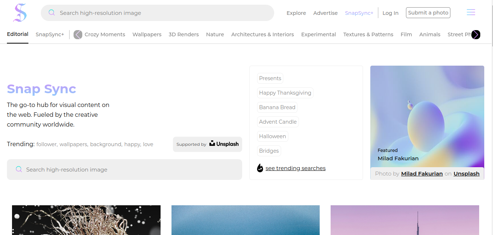

# SnapSync: Explore a Seamless Visual Journey

Welcome to SnapSync, where you can embark on a seamless visual journey through dynamic image exploration. SnapSync offers an immersive grid layout, intuitive interactions, and responsive design, providing a visually stunning and seamless discovery experience on any device. Immerse yourself in SnapSync's world of exploration!

## Description

SnapSync is a platform designed to offer users a visually engaging experience as they explore a wide range of images seamlessly transitioning between categories. With its dynamic grid layout and intuitive interactions, SnapSync provides users with an immersive exploration experience that adapts to any device, ensuring a seamless journey across various screen sizes.

## Features

- Dynamic image exploration with seamless transitions between categories.
- Immersive grid layout for visually engaging discovery.
- Intuitive interactions for effortless navigation.
- Responsive design ensuring a seamless experience on any device.

## Website URL

You can access the website here: [RayEnergies](https://snapsync.vercel.app/)

## Technologies Used

- HTML
- CSS
- JavaScript

## Usage

Explore SnapSync's visual journey by visiting the platform and navigating through the dynamic image categories. Enjoy the seamless transition and immersive grid layout across different devices.

## Screenshots

Include some screenshots or images:

## Author

- [Tufan Mulla](https://www.tufanmulla.com/)
- Email: tufanmulla@yahoo.com

## License

This project is licensed under the MIT License - see the [LICENSE](LICENSE) file for details.

## Feedback and Contributions

If you have any feedback or would like to contribute to SnapSync, feel free to open an issue or submit a pull request.

## Acknowledgments

We would like to acknowledge the following resources:

- [MDN Web Docs](https://developer.mozilla.org/en-US/): MDN Web Docs provided invaluable resources and documentation on web development technologies, including HTML, CSS, and JavaScript, which were instrumental in the development of SnapSync.

These resources played a crucial role in enhancing our understanding of web development and were instrumental in completing this project.
